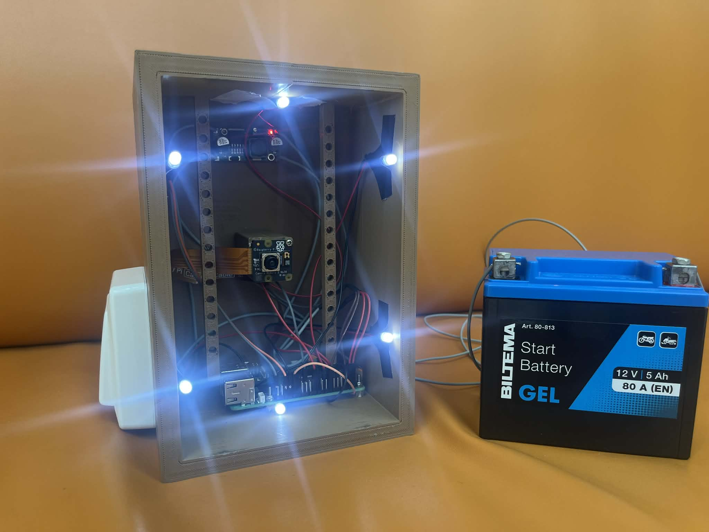
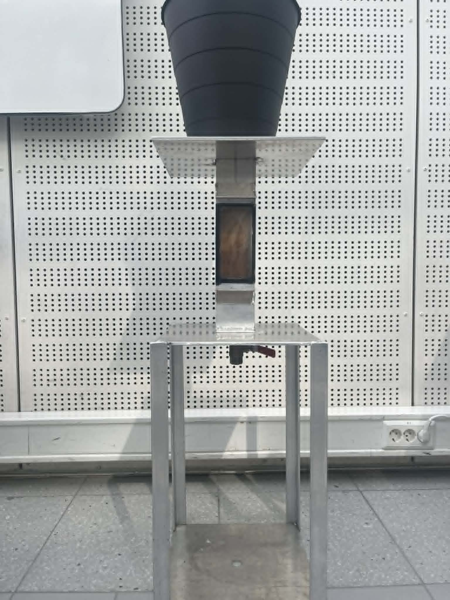
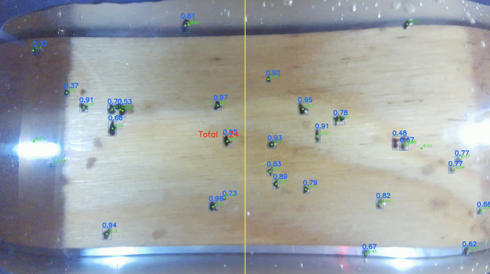
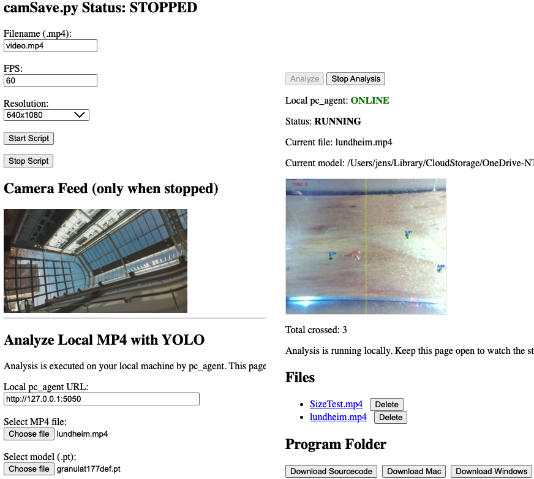

# ELPRO_VISION

## System for counting the amount of plastic granulate flowing through a pipe

<table>
  <tr>
    <td></td>
    <td></td>
  </tr>
</table>

## Result showing trained YOLO26n model successfully detecting granulate and Norfair tracking

## Website hosted by Raspberry PI controlling the system

## Project

- `pc_agent.py` links up with the website and performs the analysis in the background, displaying the resulting feed in the website
- `trackNorfair.py` contains standalone detect & tracking. Also able to save video outputs.
- `plasticpi/` contains everything needed for the Raspberry PI
- `datasets/` and `granulatModels/` hold the dataset used for training and the resulting models
- `test_videos/` stores videos used for testing the system
- `results/` stores analyzed videos and outputs after processing.
